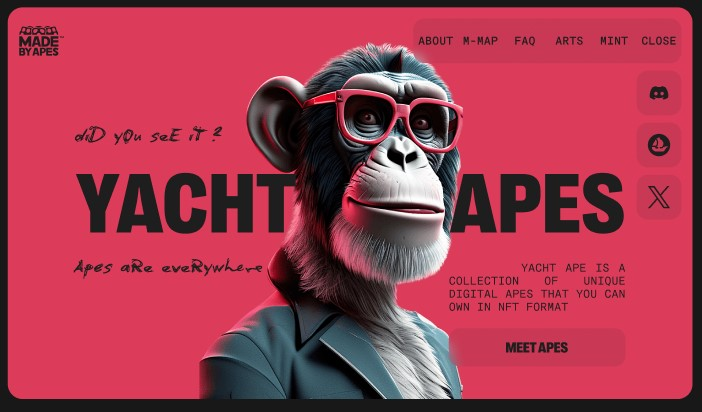

<h1 align="center">Yacht Ape</h1>
<h2 align="center">

## About this project

Yacht Ape is a is a collection of unique digital apes that you can own in NFT format. Each artwork in the collection tells a story of one journey. Arts are randomly generated by users.

The application has an adaptive design and can be used on desktops, tablets and mobile devices.

## Technologies and libraries used to create the project:

- This project was created with the help of [Vite + React](https://github.com/vitejs/vite)
- [React Select](https://react-select.com)
- [Swiper](https://swiperjs.com)
- [SASS](https://sass-lang.com/)
- [React Responsive](https://www.npmjs.com/package/react-responsive)

## Live page

Live page can be accessed via [https://dtripled.github.io/soft-ryzen/](https://dtripled.github.io/soft-ryzen/)
